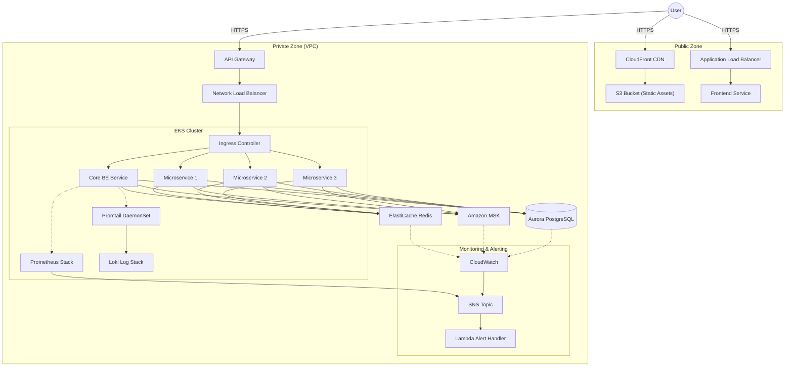

# Architecture Solution

## 1. Overview
This document outlines the architecture for a high-frequency trading system designed to meet the requirements of high availability, resilience, and cost-effectiveness on AWS.

### System Components
*   **Frontend (FE)**: A web application served via **CloudFront** (static assets) and **ALB** (dynamic/SSR content).
*   **Backend (BE)**: Composed of 1 Core Service and 3 Microservices running on containers.
*   **Database**: **Amazon Aurora PostgreSQL** (Compatible with PostgreSQL).
*   **Messaging**: **Amazon MSK** (Managed Streaming for Apache Kafka).
*   **Cache**: **Amazon ElastiCache for Redis**.

## 2. Architecture Diagram

## 3. Technology Choices & Alternatives

### Compute: Container Orchestration
We evaluated **Amazon ECS** and **Amazon EKS**.

| Feature | Amazon ECS | Amazon EKS |
| :--- | :--- | :--- |
| **Description** | AWS-native container orchestration. | Managed Kubernetes service. |
| **Pros** | Simpler, lower operational overhead, seamless AWS integration. | Industry standard, rich ecosystem, portable. |
| **Cons** | Vendor lock-in (AWS specific). | Higher complexity, control plane costs. |
| **Decision** | **Amazon EKS**. While ECS is sufficient for 500 RPS, EKS is chosen to demonstrate cloud-native mastery. It allows for advanced traffic management (Istio/Linkerd), standardized deployment manifests (Helm), and avoids vendor lock-in at the application definition level. |

### Networking
*   **API Gateway**: Acts as the entry point for the trading API, handling throttling (crucial for 500 RPS limits), authentication, and API versioning.
*   **CloudFront + S3**: Offloads static content delivery to edge locations, ensuring low latency for global users.
*   **ALB**: Used for the Frontend service to handle WebSocket connections or SSR traffic.

### Data & Messaging
*   **Aurora PostgreSQL**: Selected over standard RDS for its superior performance (5x throughput of standard MySQL/Postgres) and storage auto-scaling. It supports Multi-AZ deployment by default.
*   **Amazon MSK**: Fully managed Kafka cluster. Essential for decoupling the Core trading engine from microservices (e.g., notifications, history, analytics) to ensure the trading path remains low-latency.
*   **ElastiCache (Redis)**: Configured in Cluster Mode with Multi-AZ. Used for caching order books and user sessions to meet the <100ms p99 latency requirement.

## 4. Scalability & High Availability

### High Availability (HA)
*   **Multi-AZ Architecture**: The EKS Node Groups, Aurora DB, MSK Brokers, and Redis Nodes are distributed across 3 Availability Zones.
*   **Database Failover**: Aurora provides automatic failover in less than 30 seconds.
*   **Resilience**: The system uses a decoupled architecture (via Kafka) so that a failure in a peripheral microservice (e.g., History Service) does not impact the Core Trading Engine.

### Scaling Strategy
*   **Horizontal Pod Autoscaler (HPA)**: Automatically scales the number of pods for the Core and Microservices based on CPU/Memory usage.
*   **Cluster Autoscaler**: Provisions new EC2 nodes for the EKS cluster when resource requests exceed capacity.
*   **Read Replicas**: Aurora Read Replicas are used to serve read-only traffic (e.g., fetching historical trades), relieving pressure on the primary writer instance.

## 5. Meeting Specifications
*   **500 RPS**: The architecture is robust enough to handle 500 RPS with minimal resources (e.g., t3.medium nodes). API Gateway throttling can enforce this limit if necessary to protect downstream services.
*   **<100ms Response Time**:
    *   **Caching**: Heavy reliance on Redis for market data.
    *   **Networking**: Internal traffic stays within the AWS backbone.
    *   **CDN**: Static assets served from the edge.

## 6. Monitoring & Observability

### EKS Cluster Monitoring Options
For the Kubernetes cluster, we evaluated two primary solutions:

#### Option A: AWS CloudWatch Container Insights
*   **Description**: Native integration that collects metrics and logs from the cluster.
*   **Pros**: Fully managed, no infrastructure to maintain, seamless integration with AWS alarms.
*   **Cons**: Higher cost at scale, higher latency for metric availability compared to in-cluster solutions.

#### Option B: Prometheus Stack (Recommended)
*   **Description**: Self-hosted Prometheus (scraping metrics) + Node Exporter (hardware metrics) + Grafana (visualization) + Alertmanager.
*   **Pros**: Industry standard, real-time granularity (essential for trading), vast ecosystem, cost-effective at scale.
*   **Cons**: Operational overhead to manage the monitoring infrastructure.
*   **Decision**: **Prometheus Stack**. The sub-second metric granularity and rich query language (PromQL) are superior for debugging latency spikes in a trading environment.

### Managed Services Monitoring
For non-container resources, we utilize **Amazon CloudWatch** native metrics:
*   **Aurora DB**: CPU Utilization, Freeable Memory, Replica Lag.
*   **MSK (Kafka)**: Consumer Lag, Broker Disk Usage.
*   **ElastiCache**: Cache Hit Ratio, Evictions, CPU.
*   **ALB/API Gateway**: Request Count, 4xx/5xx Error Rates, Latency.

### Logging Strategy
*   **EKS Cluster**: We utilize the **PLG Stack (Promtail, Loki, Grafana)**.
    *   **Promtail**: Runs as a DaemonSet to scrape container logs.
    *   **Loki**: Aggregates and stores logs efficiently.
    *   **Grafana**: Visualizes logs alongside metrics.
    *   **Reason**: Lower cost than CloudWatch Logs for high-volume container logs and seamless integration with Prometheus metrics.
*   **AWS Managed Services**: **Amazon CloudWatch Logs**.
    *   Services like Aurora, MSK, and API Gateway send logs directly to CloudWatch.

### Alerting Strategy
*   **Flow**: 
    1.  **Prometheus Alertmanager** (for EKS) & **CloudWatch Alarms** (for AWS Services) detect anomalies.
    2.  Alerts are sent to an **Amazon SNS** topic.
    3.  SNS triggers **AWS Lambda** (for automated remediation) or sends notifications to **Slack/PagerDuty** for engineering intervention.
